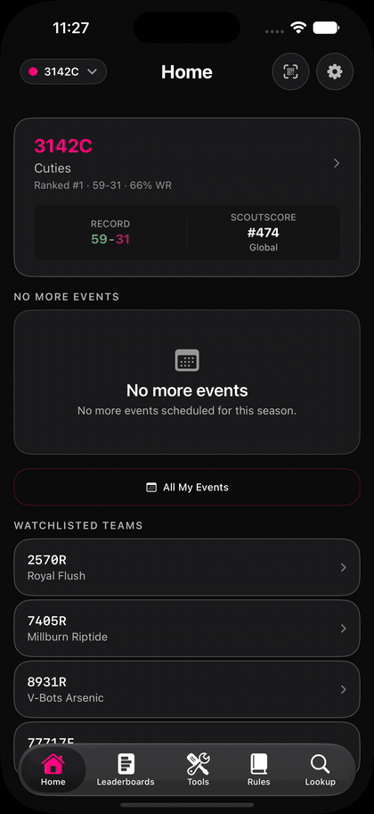

<p align="center">
  
</p>

<p align="center">
  <strong>Inline proof: the action plays directly on GitHub—no video player required.</strong>
</p>

<p align="center">
  <a href="https://github.com/henryvn27/simulator-visual-proof/actions/workflows/test.yml"></a>
  <a href="https://agentskills.io"></a>
  
  <a href="LICENSE"></a>
</p>

<h1 align="center">Simulator Visual Proof</h1>

<p align="center"><strong>Your agent changed the iOS app. Now watch it prove it.</strong></p>

An open [Agent Skill](https://agentskills.io) that autonomously plans, records, rejects, and presents proof of an AI coding agent operating your app in iOS Simulator—taps, typing, navigation, gestures, animations, and the final result. It stages meaningful real data, reviews its own artifacts, retries bad takes, and shows you only accepted proof.

```bash
npx skills add henryvn27/simulator-visual-proof -g
```

## What changes

Without this skill, visual verification often ends at “the build passed.” With it, the agent is taught to:

1. Infer the strongest proof from the change.
2. Stage the real app with the correct account, season, team, and data.
3. Rehearse and record the shortest natural interaction.
4. Map observed actions to the contract and trim idle recording boundaries automatically.
5. Reject missing actions or bad takes without asking the user to direct it.
6. Generate one `proof.md` card with inline animation and the final screenshot.

```text
infer → stage → rehearse → record → inspect → reject or present
```

Idle footage is not interaction proof. A blank screenshot is not visual proof. The skill says so explicitly.

## Try it

After installation, ask your agent:

```text
Use simulator-visual-proof. Open the changed flow in the iOS Simulator,
exercise it, inspect the result, and show me inline proof plus the final screenshot.
```

Or make it part of your repository policy:

```markdown
For visual changes, make a reasonable best-effort attempt to show a screenshot.
For interaction or motion changes, use `simulator-visual-proof` to record the
agent operating the app. This is a strong default, not a hard completion gate.
```

## Installation

The `skills` CLI works with Codex, Claude Code, Cursor, Gemini CLI, GitHub Copilot, and many other Agent Skills hosts:

```bash
# Global: available in every project
npx skills add henryvn27/simulator-visual-proof -g

# Project-local: shared with one repository
npx skills add henryvn27/simulator-visual-proof
```

Manual Codex installation:

```bash
git clone https://github.com/henryvn27/simulator-visual-proof.git \
  ~/.codex/skills/simulator-visual-proof
```

### Requirements

- macOS with Xcode command-line tools
- A booted iOS Simulator
- An agent environment capable of simulator interaction, such as XcodeBuildMCP UI automation, iOS Simulator tooling, Computer Use, or a focused XCUITest

The capture path has no package dependencies. It uses Apple-native `xcrun simctl`, `file`, and Quick Look. The deterministic video-review helper uses `ffmpeg`; machine-readable proof contracts and semantic accessibility checks use Python 3's standard library.

## How recording works

The included recorder is also usable directly:

```bash
./scripts/capture.sh video \
  --device "<simulator-udid>" \
  --output "/tmp/codex-visual-proof/checkout-flow.mp4" \
  --duration 20 \
  --stop-on-enter \
  --poster "/tmp/codex-visual-proof/checkout-flow-poster.png"
```

It:

- requires an exact booted simulator UDID;
- wakes the selected display;
- reports `RECORDING_STARTED` after the first frame;
- records H.264 for broad playback support;
- stops `simctl` with `SIGINT` so the movie finalizes correctly;
- writes through partial files so incomplete captures do not masquerade as proof;
- validates the PNG or movie before returning;
- optionally generates a poster frame for immediate inspection.

Screenshots use the same safety path:

```bash
./scripts/capture.sh screenshot \
  --device "<simulator-udid>" \
  --output "/tmp/codex-visual-proof/final-state.png"
```

Turn every source recording into directly inspectable proof before presenting it:

```bash
./scripts/review.sh video \
  --input "/tmp/codex-visual-proof/checkout-flow.mp4" \
  --output-dir "/tmp/codex-visual-proof/checkout-flow-review" \
  --plan "/tmp/codex-visual-proof/checkout-flow/proof.json" \
  --target-max-seconds 12
```

When the contract contains a `recording-start` event and logged actions, the reviewer trims only the generated GIF and storyboard to the meaningful action interval. It preserves the full MP4 as the raw source. Completion rejects uncovered planned actions and produces `proof.md`, so the agent has one accepted evidence card to present.

Create a proof contract and check the final accessibility state:

```bash
./scripts/proofctl.py init \
  --output "/tmp/proof.json" \
  --claim "Analytics contains populated trends" \
  --start "Home" \
  --action "Open Analytics" \
  --finish "Analytics" \
  --evidence video+screenshot \
  --must-contain "Performance Trends"

./scripts/proofctl.py check-state \
  --plan "/tmp/proof.json" \
  --accessibility "/tmp/finish-accessibility.json"
```

## Honest boundaries

This skill is a proof workflow, not an interaction driver. It coordinates recording with whichever simulator-control tools the agent already has.

- If interaction automation is unavailable, the agent must report the blocker instead of presenting idle footage.
- If the screen is blank, locked, or showing the wrong app, the agent must fix or disclose it.
- Capture is a strong default rather than a stop-the-line gate.
- Real available app data should be used; the skill does not encourage fabricated states.

## Permissions and privacy

The recorder runs local Apple developer tools and writes only to the output paths you provide. It does not make network requests, upload artifacts, read credentials, or install runtime dependencies.

Simulator recordings can still contain sensitive information. The skill instructs agents to keep credentials, notifications, private data, and unrelated content out of frame. Review recordings before sharing them outside your machine.

## Test it

```bash
# Fast safety and argument tests
tests/test_capture.sh
tests/test_review.sh
tests/test_proofctl.py

# Full screenshot + video + poster integration test
SIMULATOR_UDID="<booted-simulator-udid>" tests/test_capture.sh
```

The GitHub workflow runs the portable suite on macOS. The live test remains opt-in because hosted runners do not have your app or simulator state.

## Repository map

```text
SKILL.md                  Agent instructions and verification policy
scripts/capture.sh        Dependency-free screenshot/video recorder
scripts/review.sh         Inline GIF, storyboard, and review artifacts
scripts/proofctl.py       Proof contracts, state checks, and action logs
tests/test_capture.sh     Fast tests plus optional live integration test
tests/test_review.sh      Portable deterministic reviewer tests
tests/test_proofctl.py    Contract and semantic-state tests
agents/openai.yaml        Skill-list metadata
```

## Contributing

Issues and focused pull requests are welcome. For behavior changes, include the exact simulator command, expected artifact, and the test or real recording used to verify it. Never commit recordings containing credentials or private user data.

## License

[MIT](LICENSE)
